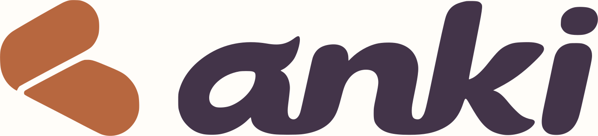

<p align="center">
  <a href="https://pablomanjarres.com/oss/anki"></a>
</p>

<p align="center"><em>A private study deck that knows which lecture and page you have reached.</em></p>

<p align="center">
  <a href="https://pablomanjarres.com/oss/anki"></a>
</p>

Anki turns reached course material and book pages into cited study cards. It reads source passages from Cortex and keeps cards, reading checkpoints, and FSRS reviews in local SQLite. The phone PWA runs on your Mac and opens through a private Tailscale address.

Thirty distinct reviews per day, five recall grades, swipe controls, and undo keep daily study bounded. ChatGPT can read eligible material and submit cited cards through 14 MCP tools. This is Pablo's own study app, separate from the Anki project at [apps.ankiweb.net](https://apps.ankiweb.net).

## Run locally

Requires Node.js, macOS, Tailscale, and local Cortex for course and book context.

```bash
npm install
npm run build
npm test
python3 ops/install_local.py
```

Open `http://127.0.0.1:3464`. The installer starts Anki at login and serves tailnet HTTPS on port 8444. Data stays in `~/Library/Application Support/Anki` across updates. The app has no public study database endpoint.

## Connect ChatGPT

`npm run mcp` starts the stdio server. For ChatGPT, use a private Secure MCP Tunnel and follow [the setup guide](docs/chatgpt.md). A local MCP connection does not establish native ChatGPT phone support.

## Brand assets

The approved [symbol](public/brand/anki-symbol.svg), [wordmark](public/brand/anki-wordmark.svg), [lockup](public/brand/anki-logo.svg), and [app icon](public/brand/anki-app-icon.svg) are generated by `ops/generate_brand_icons.mjs`. The type B lettering uses the outlined Fraunces italic shape and spacing in `ops/brand/wordmark.json`; its font license is included beside it. Run `npm run brand:icons` with librsvg installed to regenerate every asset, or add `-- --wordmark-only` to regenerate only the wordmark and lockups.

[MIT License](LICENSE) · [Landing page](https://pablomanjarres.com/oss/anki) · [Portfolio write-up](https://pablomanjarres.com/portfolio/projects/anki)
